# Forecasting_with_Prophet

1. [Section 1 (Find Unusual Patterns in Hourly Google Search Traffic)](#Section-1)
2. [Section 2 (Mine the Search Traffic Data for Seasonality)](#Section-2)
3. [Section 3 (Relate the Search Traffic to Stock Price Patterns)](#Section-3)
4. [Section 4 (Create a Time Series Model by Using Prophet)](#Section-4)

## Section 1

**Goal:** Find Unusual Patterns in Hourly Google Search Traffic for the Month of May

**May 2020 Search Trends**
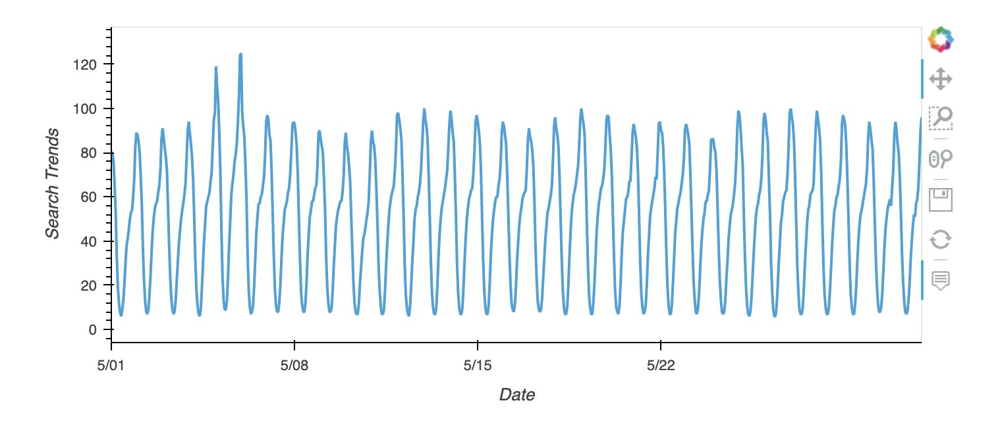

**Question 1:** Did the Google search traffic increase during the month that MercadoLibre released its financial results?

**Answer:** Yes, the total search traffic in May 2020 (the month financials results were released) was greater than the median monthly search traffic across all months. Additionally, there appears to be some higher than normal traffic around 5/05 & 05/06 of 2020.

## Section 2

**Goal:** Mine the Search Traffic Data for Seasonality (Slicing Weekly, Daily, & Hourly Data)

**Day of Week Search Trends**
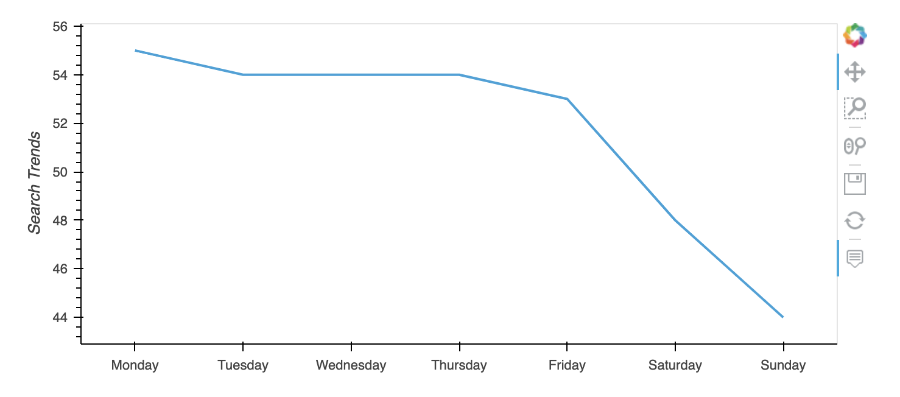

**Heatmap of Search Trends (Day of Week vs. Time of Day)**
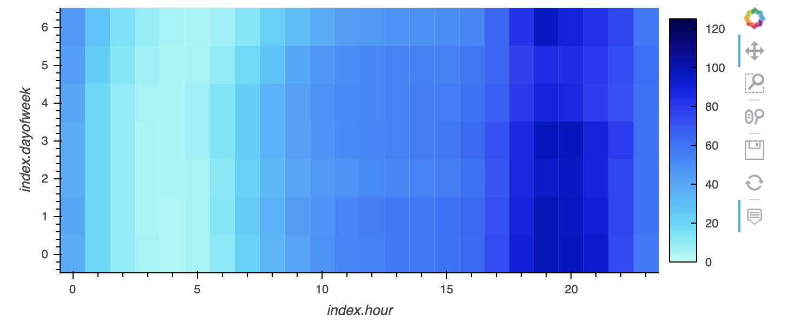

**Question 1:** Does any day-of-week effect that you observe concentrate in just a few hours of that day?

**Answer:** It appears the most traffic is Monday through Friday during hours 16 through 21 when looking at Eastern Time zone values (i.e., 4pm through 9pm EST)

**Week of Year Search Trends**
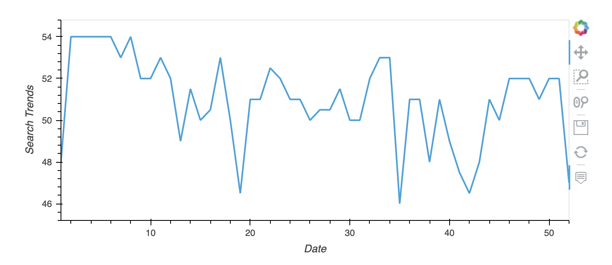

**Question 2:** Does the search traffic tend to increase during the winter holiday period (weeks 40 through 52)?

**Answer:** Overall, the search traffic is lower (on average) during the winter holiday period (when compared to earlier weeks in the year).  However, there is a jump in search traffic during winter months when compared against weeks 35 - 40.

## Section 3

**Goal:** Relate the Search Traffic to Stock Price Patterns (i.e., Concatenating Dataframes and Analyzing 2020 Data)

**Annual Stock Returns**
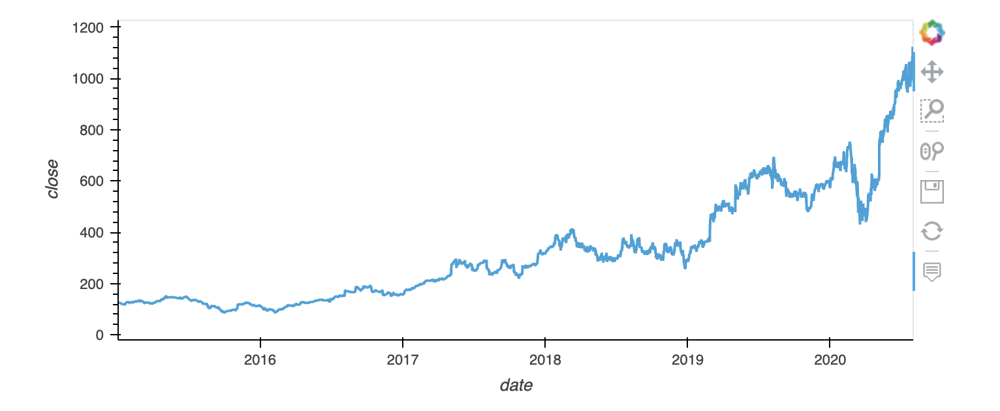

**First Half of 2020 Analysis**
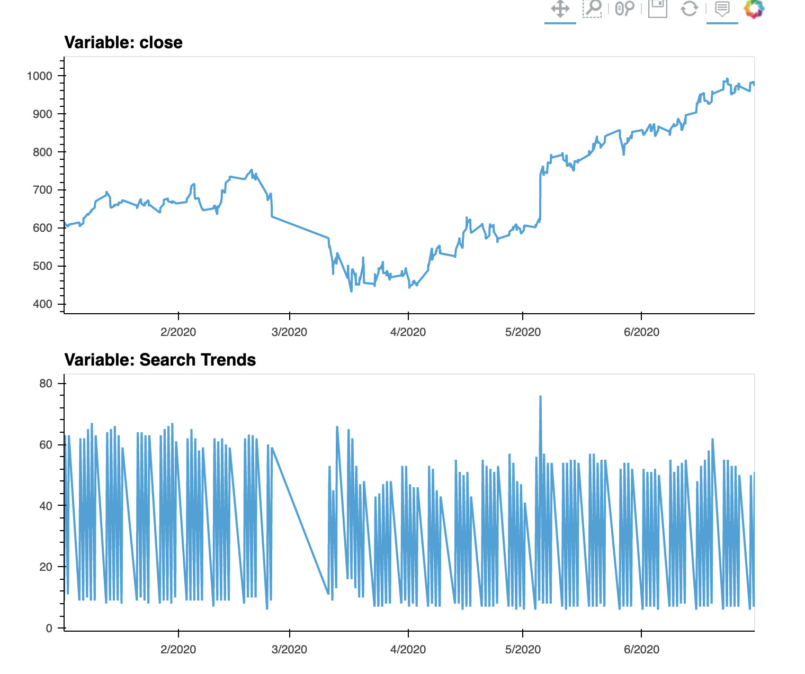

**Question 1:** Do both time series indicate a common trend that’s consistent with this narrative?

**Answer:** No, the average search trend remains relatively consistent throughout the 6 month period with a slight decrease in average searches throughout April to June.  On the other hand, the stock price recovered significantly from April through June with a positive trend upward.  There is also missing data from late February through Early March.

**Stock Volatility Chart**
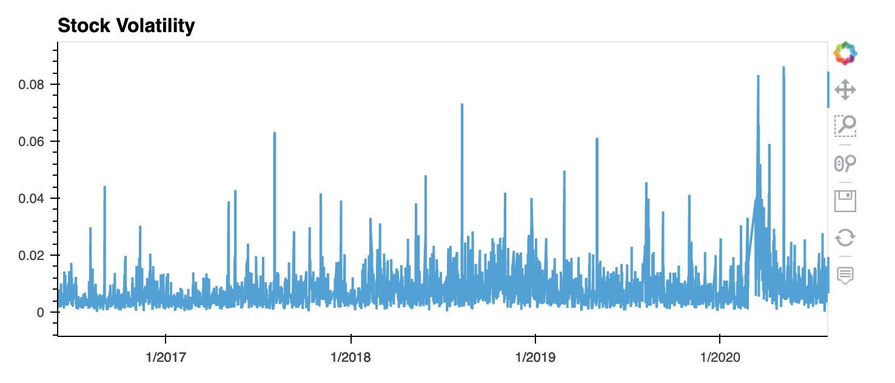

**Correlation Matrix**
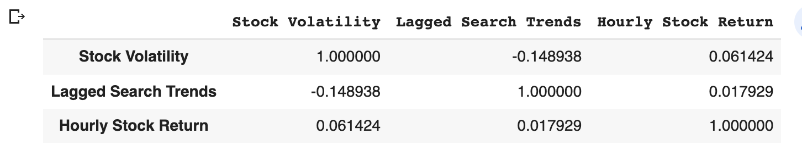

**Question 2:** Does a predictable relationship exist between the lagged search traffic and the stock volatility or between the lagged search traffic and the stock price returns?

**Answer:** There is slight inverse relationship between search traffic and stock volatility, however not incredibly meaningful.  The -.15 inverse relationship would be worth digging into a bit further.  There is no meaningful relationship betwen hourly stock return and lagged search trends (i.e., less than .02 positive relationship).

## Section 4

**Goal:** Create a Time Series Model by Using Facebook Prophet and Analyze Forecast Results

**Facebook Prophet Plot with Search Trend Prediction**
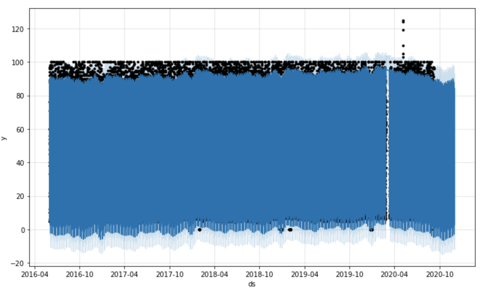

**Near-term Search Trend Forecast HvPlot**
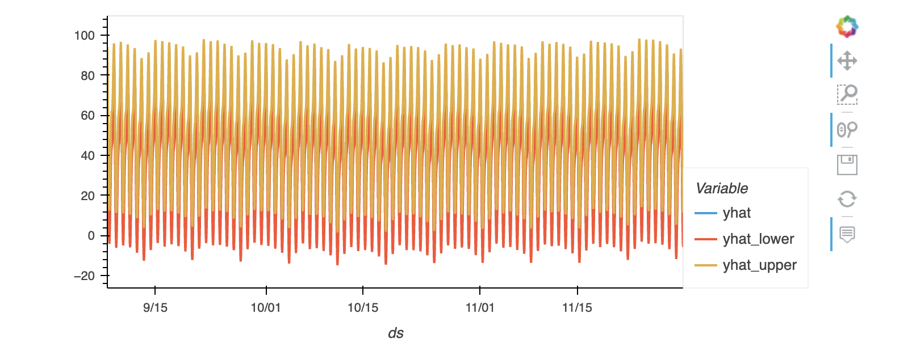

**Question 1:**  How's the near-term forecast for the popularity of MercadoLibre?

**Answer:** It appears that the near-term forecast for MercadoLibre's Google search popularity is trending downward (based on the Prophet forecast for Sept - Nov 2020).

**Facebook Prophet Plot with Seasonality Components**
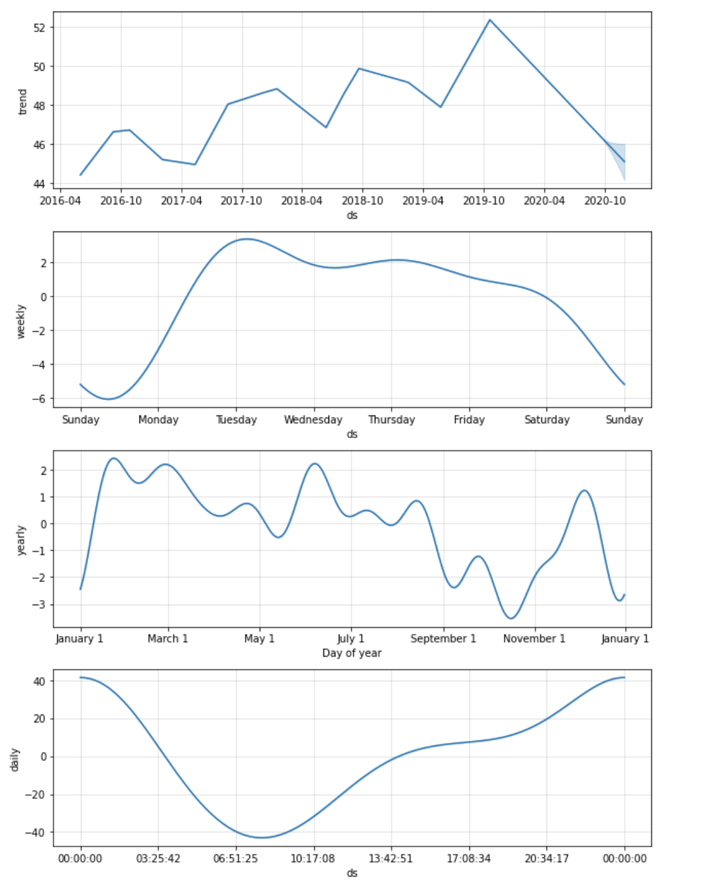

**Question 2:** What time of day exhibits the greatest popularity?

**Answer:** The greatest amount of search popularity is during the evening hours. Search popularity then goes down significantly overnight until the morning, where it starts to pick up again.

**Question 3:** Which day of the week gets the most search traffic?

**Answer:** Tuesday gets the most search traffic.  Late Monday and Wednesday also have high search traffic.

**Question 4:** What's the lowest point for search traffic in the calendar year?

**Answer:** Typically right before November 1st is the lowest search traffic.  Then the search traffic picks back up following that for the holidays.